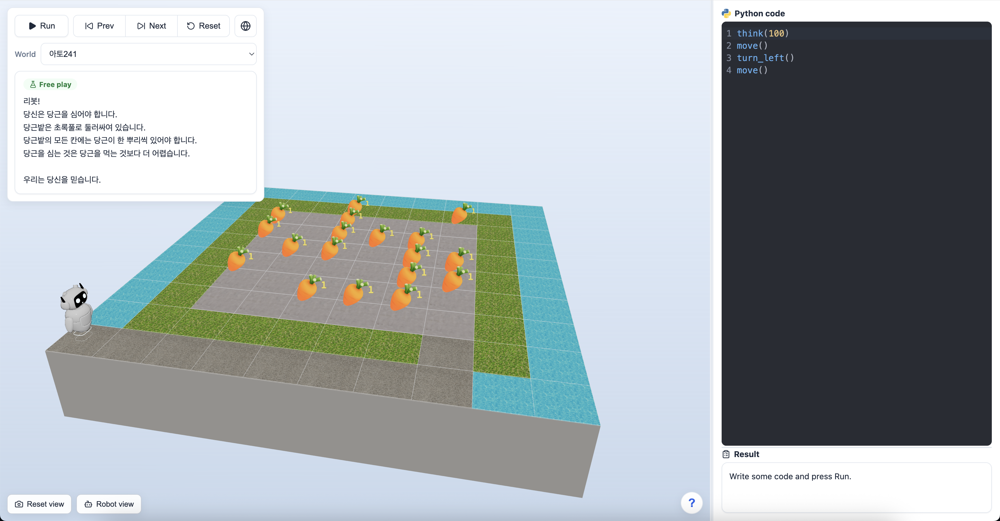
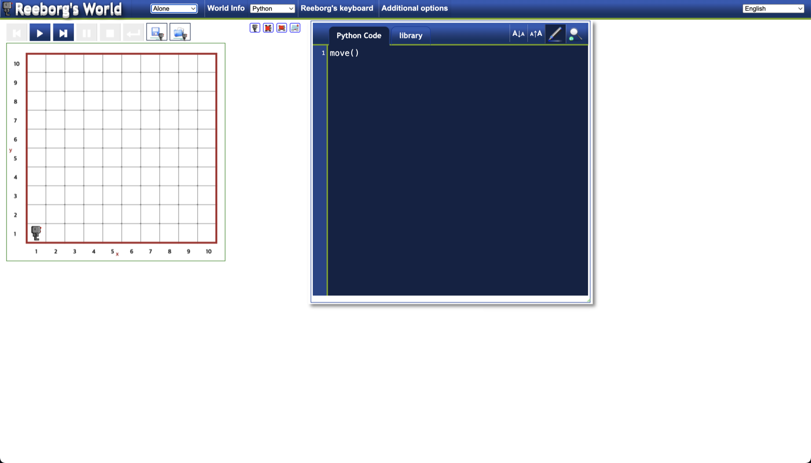
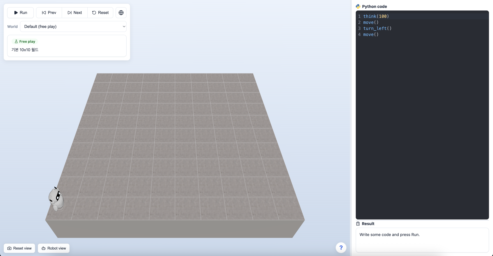
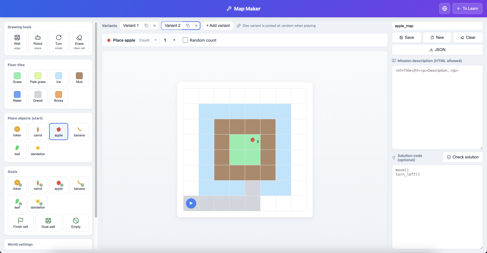
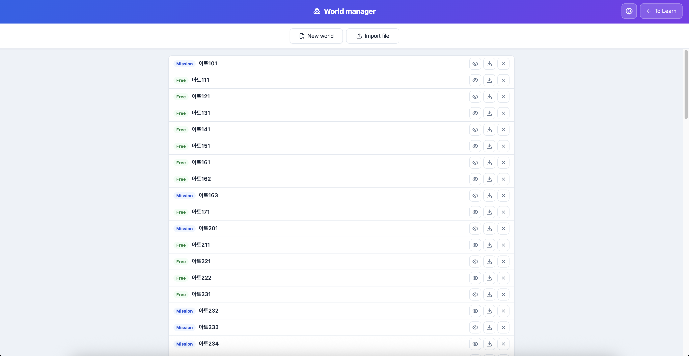

<h1 align="center">The-Reeborg-was-replaced</h1>

<p align="center">
  <b>3D 세계에서 로봇을 파이썬으로 움직이며 배우는 코딩 — 직접 맵을 만드는 메이커까지.</b><br/>
  <a href="https://reeborg.ca/reeborg.html">Reeborg's World</a>를 아이들과 입문자를 위해 3D로 재해석한 프로젝트입니다.
</p>

<p align="center">
  <i>오른쪽에 파이썬을 쓰면, 왼쪽 3D 세계에서 로봇이 바로 움직입니다.</i>
</p>

<p align="center"><a href="README.md">English</a> · 한국어</p>

---

## 어떤 프로젝트인가요?

**The-Reeborg-was-replaced**는 학습자가 3D 세계에서 파이썬으로 로봇을 조종하며 프로그래밍을 배우는 브라우저 학습 도구입니다. 고전 **Reeborg's World**에서 영감을 받아, 실시간 3D 엔진, 친절한 에디터, 아이 눈높이 피드백, 그리고 코드 없이 맵을 만드는 **맵 메이커**를 처음부터 새로 만들었습니다.

모든 것이 **브라우저 안에서** 돌아갑니다 — 파이썬 코드는 [Pyodide](https://pyodide.org/)로 클라이언트에서 직접 실행되어 **서버가 필요 없습니다.**

<p align="center">
  <br/>
  <sub>실시간 3D 세계 속 미션 한 장면.</sub>
</p>

### 원본 vs. 리메이크

원조 Reeborg's World는 2D 격자에 고전적인 인터페이스입니다. 이 프로젝트는 같은 교육 아이디어를 유지하면서, 경험을 실시간 3D 세계와 현대적인 UI로 새로 만들었습니다.

<table>
<tr>
<td width="50%" align="center">
  <br/>
  <sub><b>Reeborg's World</b> — 원조: 평면 2D 격자, 고전 UI</sub>
</td>
<td width="50%" align="center">
  <br/>
  <sub><b>The-Reeborg-was-replaced</b> — 실시간 3D 세계, 현대적 UI</sub>
</td>
</tr>
</table>

---

## 주요 기능

- **진짜 파이썬을 브라우저에서** — Pyodide(WebAssembly)로 실행, 백엔드 불필요.
- **3D 뷰포트** — 로봇·물건·벽·타일과 단단한 "고원" 바닥을 Three.js로 실시간 렌더링.
- **친절한 에디터** — 문법 강조, Reeborg API 자동완성, **실행 줄 하이라이트**(초록=실행 중, 빨강=오류 줄).
- **단계 실행** — 실행·멈춤·이전·다음·처음으로, 동작을 한 칸씩 따라갈 수 있어요.
- **목표 체크리스트** — 미션마다 조건별 체크리스트로 *부분 진행도*까지 보여줍니다(통과/실패만이 아니라).
- **아이 눈높이 오류 메시지** — 날것의 파이썬 트레이스백을 정확한 줄을 짚는 쉬운 안내로 번역.
- **로봇 1인칭 시점** — 로봇의 눈으로 세계를 봅니다.
- **시각적 맵 메이커** — 클릭으로 벽·타일·물건·목표를 배치. 저장·테스트·JSON 내보내기까지 코드 없이.
- **코드 없는 랜덤 월드** — 맵 *변형*을 여러 개 묶으면 실행마다 하나가 무작위로 나와, 하드코딩된 정답으론 못 풀게 됩니다.
- **진행도 · 정답 보기** — 클리어한 미션 기억(localStorage), 월드에 선택적 **"답 보기"** 코드 제공 가능.
- **한국어 / English** — 학습 화면과 맵 메이커 모두 앱 안에서 언어 전환.

<p align="center">
  <br/>
  <sub>전체 인터페이스 — 미션 &amp; 목표 체크리스트, 실시간 3D 세계, 그리고 결과 창이 있는 파이썬 에디터.</sub>
</p>

---

## 로봇 API (직접 쓰는 파이썬)

| 명령 | 설명 |
|---|---|
| `move()` | 앞으로 한 칸 이동 |
| `turn_left()` | 왼쪽으로 90° 회전 |
| `take()` | 현재 칸의 물건 줍기 |
| `put()` | 가진 물건 내려놓기 |
| `build_wall()` | 바라보는 방향에 벽 세우기 |
| `done()` | 여기서 실행 끝내기 |
| `think(ms)` | 동작 사이 간격 설정(클수록 천천히) |
| `wall_in_front()` / `wall_on_right()` | 그쪽에 벽이 있으면 `True` |
| `front_is_clear()` | 앞이 비어 있으면 `True` |
| `object_here()` | 현재 칸에 물건이 있으면 `True` |
| `at_goal()` | 목표에 도달했으면 `True` |
| `print(...)` | 결과 창에 글자 표시 |

`if`, `while`, `for`, `def`, 함수, 변수 등 표준 파이썬 문법도 모두 사용할 수 있습니다. 앱에서는 세계 **우측 하단의 "?"** 버튼을 누르면 같은 도움말이 열립니다.

---

## 시작하기

**준비물:** [Node.js](https://nodejs.org/) **20.19+ 또는 22+**.

```bash
# 1. 의존성 설치 (최초 1회)
npm install

# 2. 개발 서버 실행 (자동 새로고침)
npm run dev          # → http://localhost:5173

# 3. 또는 배포 빌드 + 미리보기
npm run build        # 정적 파일을 dist/ 에 생성
npm run preview      # → http://localhost:4173
```

> 처음 **▶ 실행**을 누를 때 파이썬 엔진(Pyodide)을 CDN에서 내려받으므로, 로컬에서도 **인터넷 연결이 필요**합니다.

---

## 맵 메이커

**`/maker`**(또는 맵 메이커 버튼)를 열어 월드를 시각적으로 만듭니다:

- **그리기 도구** — 로봇 위치·방향, 칸 모서리를 클릭해 **벽**, **바닥 타일** 칠하기, 지우개.
- **물건 두기** — 종류(토큰·당근·사과…)를 고르고 클릭해 배치. 옵션 바에서 고정 **개수** 또는 **랜덤 범위** 설정.
- **목표 만들기** — 목표 물건("**모두** 모으기" 포함), 빈 칸 목표, 목표 벽, 도착 칸.
- **변형(variants)** — 한 월드에 맵을 여러 개. 실행 시 **하나가 무작위로** 나옵니다(외워서 못 푸는 도전에 유용).
- **저장 / 테스트 / 내보내기** — 월드는 브라우저(localStorage)에 저장되고 JSON으로 내보낼 수 있습니다.

저장한 월드는 학습 화면의 **"내가 만든 월드"** 드롭다운에 나타납니다.

<p align="center">
  <br/>
  <sub>벽/타일/물건/목표를 그리고, 변형을 관리한 뒤 저장·테스트.</sub>
</p>

**월드 매니저**는 모든 월드를 한눈에 보여줍니다 — 기본 제공 **Mission**과 직접 만든 **Free** 월드를 미리보고, JSON으로 **가져오기/내보내기**하거나 삭제할 수 있습니다.

<p align="center">
  <br/>
  <sub>월드 매니저 — 월드를 미리보고 가져오기·내보내기·삭제한 뒤 학습 화면으로 돌아갑니다.</sub>
</p>

---

## 월드 포맷

월드는 정규 **v2** 스키마(`public/worlds/*.json`)의 JSON이며, 단일 진입점 `normalizeWorld()`가 v2와 레거시 Reeborg export를 모두 읽습니다:

```jsonc
{
  "version": 2,
  "name": "아토241",
  "size": { "rows": 8, "cols": 12 },
  "robot": { "x": 1, "y": 1, "dir": "E", "tokens": 0 },
  "walls":   { "3,3": ["north", "east"] },
  "objects": { "5,4": { "carrot": 3 } },     // 또는 범위: { "carrot": { "min": 1, "max": 5 } }
  "tiles":   { "5,4": "grass" },
  "goal":    { "objects": { "9,1": { "carrot": "all" } } },
  "description": ["<h1>제목</h1><p>…</p>"],
  "solution": ["move()", "turn_left()"]
}
```

**변형 묶음**은 `"variants": [ { …월드… }, … ]`로 여러 맵을 담아 실행마다 하나를 무작위 선택합니다.

`public/worlds/index.json`은 미션 목록 레지스트리입니다(앱이 런타임에 fetch하는 커밋 필수 파일).

---

## 프로젝트 구조

```
src/
  App.tsx                 # 레이아웃, 월드 선택, 라우팅, 팝업
  main.tsx                # 라우트(/, /world/:id, /maker, /maker/:id) + i18n 프로바이더
  core/                   # 프레임워크 비의존 엔진 (React 없음)
    engine/               # 액션 큐, 스텝 실행, 되감기
    py/                   # Pyodide 브리지: 파이썬 ↔ 엔진
    renderer/             # Three.js 씬, 로봇, 벽, 물건, 타일, 절벽 바닥
    world/                # v2 로더, 목표 평가, onload, 물건/타일 종류
    types/                # 공용 타입 (World, WorldV2, Goal…)
  ui/
    components/           # Viewport, Controls, Editor, MissionPanel, ResultPanel, 팝업
    maker/                # 맵 메이커 (모델 + UI)
    useExecution.ts       # 엔진 ↔ UI 연결 훅 (실행/멈춤/스텝/리셋)
    i18n.tsx              # 한국어/영어 문자열 + 언어 토글
    messages.ts, pythonErrors.ts, progress.ts, customWorlds.ts
public/
  worlds/                 # *.json 미션 + index.json 레지스트리
scripts/
  migrateWorldsToV2.ts    # 레거시 → v2 1회성 마이그레이션 도구
assets/                   # 스크린샷 (이 README에서 사용)
```

---

## 기술 스택

**React + TypeScript** · **Vite** · **Three.js**(3D) · **Pyodide**(브라우저 파이썬) · **CodeMirror**(에디터) · **React Router**

---

## 라이선스

ISC. 자세한 내용은 `package.json` 참고.
